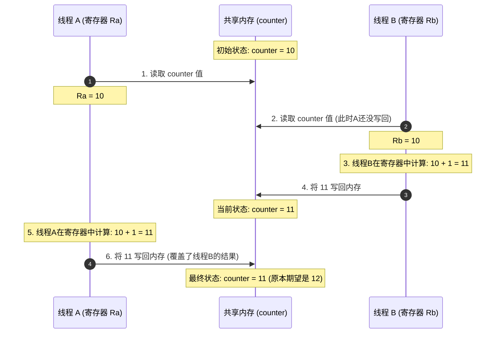

# 01 Increment Counter

在讨论有关高并发问题的开始，我决定先引入一个非常经典的案例——递增计数器。

```c++

#include <iostream>

int counter = 0;

int main() {


    for (int i = 0; i < 10000; ++i) {
        counter++;
    }

    std::cout << "Counter is: " << counter << '\n';

    return 0;
}

```

在这个案例中，最终的输出结果肯定是`Counter is: 10000`，但我们必须去讨论一下`counter++;`这行代码到底在做什么。我们看一下gcc下的汇编指令。

```asm
        mov     eax, DWORD PTR "counter"[rip]
        add     eax, 1
        mov     DWORD PTR "counter"[rip], eax
```

可以看出，cpu的操作是，讲counter放入`eax`寄存器中，然后`add`完成加1，在从寄存器中取值`mov`到counter地址中。

也就是表面非常简单的自增运算，cpu层其实执行了三条指令。

正是因为这是一条三指令的叠加，于是在多线程中，我们就看到了如下的现象：

```C++
#include <iostream>
#include <thread>
#include <vector>

int counter = 0; 

void increment() {
    for (int i = 0; i < 10000; ++i) {
        counter++;
    }
}

int main() {
    std::vector<std::thread> threads;
    for (int i = 0; i < 10; ++i) {
        threads.emplace_back(increment);
    }
    
    for (auto& t : threads) {
        t.join();
    }
    
    std::cout << "Expected: 100000, Got: " << counter << std::endl;
}
```

最终我的输出结果为：`Expected: 100000, Got: 91163`。

原因是什么呢？




本质原因是：

* 寄存器是线程私有的，但`counter`所在的内存是线程共享的。

* 当一个线程把值拿到寄存器修改期间，它不知道，也管不到其他线程把内存里面的改改成了什么样子。

* 于是大家都基于自己可以看到的“错误的值”进行计算并互相覆盖对方的结果。
